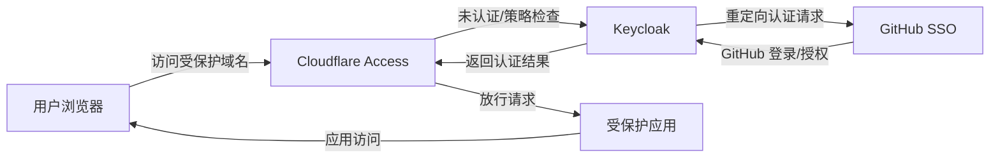

# Cloudflare + Keycloak + GitHub SSO 架构文档

## 1. 目标与背景

本文档描述将 Cloudflare Access 与 Keycloak 联合 GitHub SSO（GitHub 作为身份提供方，IdP）集成的典型架构和实现思路。

目标是提供一个安全、统一的访问控制方案：

- 通过 Cloudflare Access 保护 Web 应用和内部服务
- 使用 Keycloak 作为统一认证代理和策略网关
- 将 GitHub 作为外部身份提供方，实现企业 GitHub 账号登录

适用场景：

- 需要对外网访问进行访问控制、WAF 保护、Zero Trust 访问
- 需要实现统一身份目录、组权限、会话管理
- 需要将 GitHub 账号作为 SSO 登录源

---

## 2. 关键组件

### 2.1 Cloudflare Access

- 作为 Zero Trust 网关，前置于应用前端
- 请求经过 Cloudflare 认证/授权策略检查
- 支持多种身份提供方（IdP）和身份联合
- 可以保护私有应用、Web 服务、API

### 2.2 Keycloak

- 作为 Identity Broker / 中央认证服务器
- 对接 GitHub OIDC/OAuth2 作为外部身份提供方
- 提供统一会话、用户映射、客户端授权
- 支持多租户 Realm、用户组、角色映射

### 2.3 GitHub SSO

- GitHub 组织或企业账号作为身份源
- 使用 OAuth2 或 OIDC 登录
- 通过 Keycloak 作为中间 Broker，实现统一登录体验

### 2.4 应用 / 后端服务

- 由 Cloudflare Access 保护的目标应用
- 可以是内部管理系统、控制面板、API 网关等
- 后端可继续使用 Keycloak JWT/Session 做二次授权

---

## 3. 架构流程

### 3.1 典型访问顺序

1. 用户访问受保护应用域名（例如 `https://app.example.com`）
2. 请求先到 Cloudflare Network
3. Cloudflare Access 判断用户是否已登录并满足策略
4. 若未登录，Cloudflare 跳转到 Keycloak 登录入口
5. Keycloak 作为 Identity Broker，将用户重定向到 GitHub SSO
6. 用户在 GitHub 登录并授权后，GitHub 返回授权码给 Keycloak
7. Keycloak 验证并创建本地会话，可能映射用户属性和组
8. Keycloak 返回认证结果给 Cloudflare
9. Cloudflare 根据策略放行请求，并将访问令牌/头部传递到后端应用
10. 后端应用可以使用 Cloudflare/Keycloak 提供的身份信息做授权

### 3.2 交互关系图

---

## 4. 实现要点

### 4.1 Keycloak 配置

- 创建 Realm，例如 `cloudflare-access`
- 添加 GitHub 作为外部身份提供方：
  - 类型：OIDC 或 OAuth2
  - Client ID / Client Secret：来自 GitHub OAuth App
  - 回调 URL：`https://<keycloak-domain>/auth/realms/<realm>/broker/github/endpoint`
- 配置 GitHub Scopes：`read:user user:email`，必要时还可加 `read:org`
- 配置用户映射规则：
  - 将 GitHub 用户名映射到 Keycloak `username`
  - 将 GitHub 组织或团队映射到 Keycloak `groups`
- 配置客户端（Client）供 Cloudflare 使用：
  - Client Protocol：openid-connect
  - Access Type：confidential
  - Valid Redirect URIs：Cloudflare Access 回调地址
  - 授权类型：Authorization Code

### 4.2 Cloudflare Access 配置

- 在 Cloudflare Zero Trust 控制台中创建应用
- 选择“Self-hosted”或“Web Application”类型
- 设置应用域名和原始服务器地址
- 配置 Identity Provider：指向 Keycloak OpenID Connect
  - Issuer URL：`https://<keycloak-domain>/auth/realms/<realm>`
  - Client ID / Secret：来自 Keycloak 客户端
  - Scopes：`openid email profile`
- 配置访问策略：
  - 允许策略：根据 `email`、`group`、`email ending with` 或 Keycloak 属性
  - 阻止策略：限制非 GitHub 登录、未知用户
- 如果需要，可启用 Access Policy Enforcements：
  - MFA
  - 地理位置
  - 设备信任

### 4.3 GitHub SSO 注册

- 在 GitHub 企业设置中创建 OAuth App：
  - Application name：如 `Keycloak SSO`
  - Homepage URL：Keycloak 基本地址
  - Authorization callback URL：与 Keycloak 配置一致
- 在 GitHub 组织中允许 OAuth App 访问
- 如使用 GitHub Enterprise，可配置企业级 SSO 策略

### 4.4 安全与令牌管理

- Cloudflare Access 可传递 JWT/Headers 给后端
- 后端可使用 Cloudflare 提供的 `Cf-Access-Jwt-Assertion` 或自定义头
- Keycloak 可以生成 ID Token / Access Token，用于后端二次校验
- 建议开启 Token Introspection 或 JWT 验证逻辑
- 注意令牌有效期：避免 session 过长导致安全风险

---

## 5. 参考架构线路

### 5.1 方案 A：Cloudflare Access 直接对接 Keycloak OIDC

- Cloudflare 用 `Keycloak` 作为 IdP
- Keycloak 用 `GitHub` 作为外部 IdP
- 适合需要统一身份管理、审计、组映射的场景

优点：
- Cloudflare 负责边界保护，Keycloak 负责身份桥接
- 支持其他身份源扩展（LDAP、Azure AD、Google）

### 5.2 方案 B：Cloudflare Access 直接对接 GitHub（无 Keycloak）

- Cloudflare 直接使用 GitHub 身份提供方
- 适合简单场景，但缺少统一用户桥接与组策略

本文建议：
- 采用方案 A，Keycloak 作为中间 Broker，可统一管理登录策略和属性映射

---

## 6. 优势与注意事项

### 6.1 优势

- 统一认证架构：Keycloak 可作为单一入口，支持多个外部 IdP
- 安全边界清晰：Cloudflare 提供 Zero Trust 边界、防 DDoS、WAF
- 灵活策略：Cloudflare Access 和 Keycloak 两端均可施加策略
- GitHub SSO 兼容：利用现有 GitHub 企业账号，无需新建本地账号

### 6.2 注意事项

- 依赖性增加：Cloudflare、Keycloak、GitHub 三方联动，故障排查要关注链路
- 回调 URL 与重定向地址必须严格一致
- GitHub 组织权限与应用授权需提前规划
- Keycloak 用户组映射需要与 Cloudflare 策略字段对应
- 若使用 Cloudflare Tunnel，需同时保证 Cloudflare 与 Keycloak 之间通信可达

---

## 7. 典型部署建议

- 使用独立域名：如 `idp.example.com` 运行 Keycloak
- 将 Cloudflare Access 应用绑定到受保护域：如 `app.example.com`
- 为 Keycloak 开启 HTTPS / TLS
- 在 GitHub OAuth App 中填写 Keycloak 回调地址
- 在 Cloudflare Access 中启用 Session 持久化和审计日志
- 如果业务系统需要，后端可继续验证 `Cf-Access-Jwt-Assertion`

---

## 8. 结论

Cloudflare + Keycloak + GitHub SSO 的组合，适合需要企业级 Zero Trust 访问与统一身份桥接的场景。Keycloak 负责 GitHub 身份代理与本地会话，Cloudflare 负责接入边界保护和访问策略，能够实现可控、可审计、可扩展的混合认证架构。

如果需要，我可以进一步补充具体 Keycloak 配置步骤和 Cloudflare Access 应用策略示例。